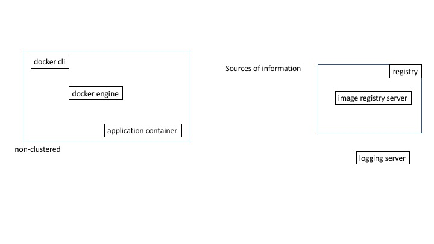
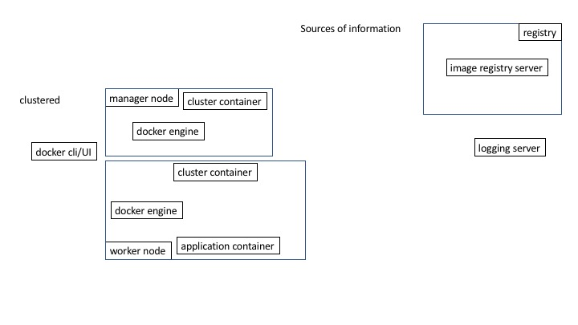
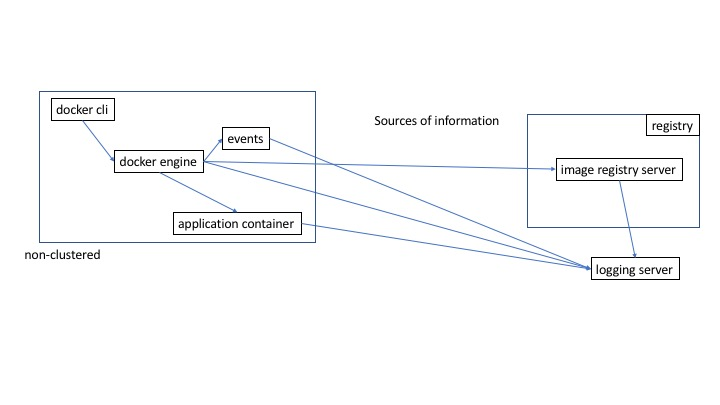
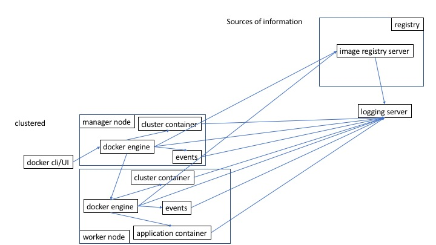
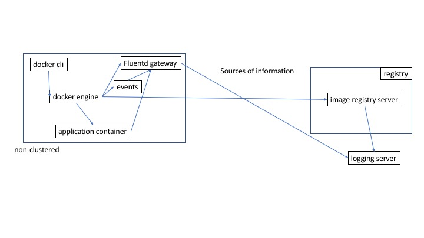

## Integrating Docker and Splunk
##### <span style="font-family:Helvetica Neue; font-weight:bold"><span style="color:#e49436">SplunkersDC Meetup, 31-May-2017</span>
<span style="color:#e49436">dougtoppin@gmail.com</span>
<span style="color:#e49436"><a target="_blank" href="https://www.meetup.com/SplunkersDC/">www.meetup.com/SplunkersDC/</a></span>
<span style="color:#e49436"><a target="_blank"  href="https://github.com/dougtoppin/presentation-splunk-docker">github.com/dougtoppin/presentation-splunk-docker</a></span>

---

## Agenda

* The world of containers
* Challenges presented by containers
* Log aggregation systems
* Approaches for managing logs
* Container environments
* Architectures for managing logs
* Lessons learned

---
### The world of containers

* Evolution from VMs
* Various approaches and vendors
* Microservices
* Clusters
* Distributed applications
* Many more potential monitoring points


---
### Challenges presented by containers

* Scaling of containers
* Scaling of nodes
* Potentially ephemeral but maybe not
* Should containers and cluster nodes register with the aggregation system or simply come and go?
* Small applications comprising a service all over the place
* Request tracking of the entire chain may be difficult

+++
### Challenges presented by containers

* Management and orchestration also very distributed
* Superfluous log data
* Container systems evolving
* How much of the container and clustering environment/engines do you also monitor?
* How does the log aggregator identify who is sending the logging and associate related services?

+++
### Challenges presented by containers
* Likely many more sockets/connections consuming system resources
* Another UI/management/monitoring system for ops to learn
* Container environments and orchestration systems are evolving, how closely do you need to monitor them?
* Administrator (people with access really) behavior such as exec'ing a shell into a container with secrets

+++
### Challenges presented by containers

Basic components of a container system


+++
### Challenges presented by containers
Clusters complicate things



---
### Log aggregation systems

What are log aggregation systems?

Centralized point to send and access logs from a system of various components.
May also include automatic analytics capabilities.

+++
### Log aggregation systems

Log aggregation systems have these questions
* Who sent this?
* Where did it come from?
* What is it?
* What format is it in?
* What is in it?
+++
### Log aggregation systems

Log aggregation systems have these questions
* Should it be grouped with other stuff?
* Do I care about it?
* How long should I keep it?
* Should I notify someone because of this?

+++
### Log aggregation systems
* What they are and do
* Receive and index data that may or may not be structured
* Support push and pull models for collecting data
* Used for troubleshooting, general awareness and may support business analytics
* Have to interpret and present various types of information
+++
### Log aggregation systems
* UI should be relatively easy to use
* Should have a dashboarding capability where canned queries produce understandable information
* Data management must be secure due to the potential nature of log entry content
* Support notification rules

+++
### Log aggregation systems
* Why they are necessary
* Central place to access data as opposed to many individual servers
* Provide historical records of what happened to compare with (have we seen this before?, is this what happened last time?)

+++
### Log aggregation systems

* Open source, likely consisting of multiple components
 * ELK
 * EFK

+++
### Log aggregation systems

* Proprietary
 * Loggly
 * Sumo Logic
 * AWS CloudWatch
 * Google Stackdriver
 * Splunk
* In-house developed

---
### Container environments

* Providers include
 * Docker (swarm/ucp)
 * Red Hat Openshift (Kubernetes++)
 * Google Cloud (Kubernetes)
 * AWS ECS
+++
### Container environments

Methods for collecting information from
  * Log files
  * rsyslog
  * Engine
  * Application container
  * API (particularly for non-logged things)
<a target="_blank"  href="  https://docs.docker.com/engine/api/v1.29/#operation/TaskLogs">docs.docker.com/engine/api/v1.29/#operation/TaskLogs</a>


+++
### Container environments
* What might be of interest to collect?
  * Infrastructure
  * Engine logs
  * Engine events
  * Who is doing what?
  * Cluster management logs
  * Is anything wrong?
+++
### Container environments
* What might be of interest to collect?
  * Registry and repository information
  * Images and versions pushed
  * Authentication failures
  * Image vulnerability scanning results
  * Content trust (image signing) failures
  * Application container logs

---
### Approaches for managing logs

* Integrating with an existing log aggregation system (probably not greenfield)
* Logging gateways (Fluentd) are useful for filtering data before sending to ingestion
* syslog/rsyslog (from containers and hardware) and log files all contribute to log data
* Cost of aggregation systems (capacity, storage, long term data maintenance)

+++
### Approaches for managing logs

* Intelligent log aggregation systems that can support analytics are useful for providing more than just awareness
* Developers need to be cognizant of the value of logging
* Log aggregation needs to be available for all phases of software dev/test/prod
* Need for dashboards prepared in advance by developers

+++
### Approaches for managing logs

* Risky to be implemented as a part of the system such as being containers in the cluster because the cluster or components may fail causing the logging system to fail
* Having them standalone may be the safest but involves more cost
* Including tags/labels indicating service on containers can help the aggregation system classify what is received

+++
### Approaches for managing logs

* Aggregation system ingestion points can help classify and group incoming data
* Queueing system for sending entries to avoid blocking senders

+++
### Approaches for managing logs

* Forwarding to log aggregator might break local log output such as in OpenShift HAProxy syslog port, adding sidecar support for an rsyslog handler might alleviate this
* Enriching container log data at the engine level using tags (https://docs.docker.com/engine/admin/logging/log_tags/) can be very helpful to the aggregation system
* Note that using a logging driver might prevent using ‘docker logs container’ from working

---
### Architectures for managing logs

Send it all to the aggregator



+++
### Architectures for managing logs

Clustered means numerous connections



+++
### Architectures for managing logs
Everything combined


+++
### Architectures for managing logs

Logging gateway per node can reduce paths to aggregator but how is Fluentd configured dynamically?



---
### Docker Events

Events list the lifecycle of the following resources.
They can provide great insight on exactly what is happening.

<a target="_blank"  href="https://docs.docker.com/engine/reference/commandline/events/">docs.docker.com/engine/reference/commandline/events/</a>
<a target="_blank"  href="https://gliderlabs.com/devlog/2015/docker-events-explained/">gliderlabs.com/devlog/2015/docker-events-explained/</a>

* containers: attach commit copy create destroy detach die exec_create exec_detach exec_start export health_status kill oom pause rename resize restart start stop top unpause update
* images: delete import load pull push save tag untag

+++
### Docker Events

* plugins: install enable disable remove
* volumes: create mount unmount destroy
* networks: create connect disconnect destroy
* daemon: reload

+++
### Docker Events
Method for filtering out uninteresting events
```
nohup docker events --format '{{json .}}' | jq -c -M 'select(
        (.Type!="volume" and .Actor.ID!="ucp-metrics-inventory")
    and (.Type!="volume" and .Actor.ID!="ucp-controller-client-certs")
    and (.Status!="archive-path" and .Action!="archive-path")
    and (select([.status] | contains(["curl"]) | not))
    and (select([.status] | contains(["ping"]) | not))
    and (select([.status] | contains(["health"]) | not))
)
' > splunk-events.json 2>&1 &
```
---
### Lessons Learned

* Identifying and filtering out what is not needed is useful at the start, risk of eventual license exhaustion and cost increases later if you do not
* How will long term data storage be managed
* Developers must recognize the value and provide log entries that are complete and useful rather than numerous little messages that could have been contained in a single message
* Useful to be able to query for what’s being logged that wasn’t before

+++
### Lessons Learned

* Filtering out what you do not need might be better than filtering in what you want (so that you do not miss anything new)
* Useful to filter out what you don't want rather than filter in because you might miss events that prove useful
