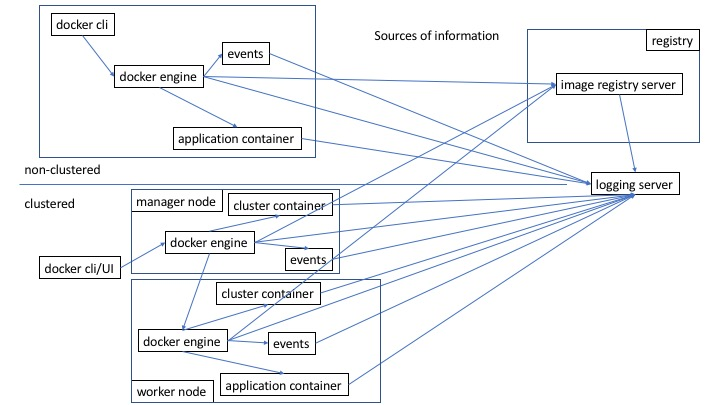

## Integrating Docker and Splunk
##### SplunkersDC Meetup, 31-May-2017
dougtoppin@gmail.com
[https://www.meetup.com/SplunkersDC/](https://www.meetup.com/SplunkersDC/)

View this using [GitPitch](https://gitpitch.com/dougtoppin/presentation-splunk-docker)
---

## Agenda

* The world of containers
* Challenges presented by containers
* Log aggregation systems
* Approaches for managing log and related data
* Container environments
* Architectures for managing log and related data

---
## The world of containers

* Evolution from VMs
* Microservices
* Clusters
* Distributed applications
* Many more potential monitoring points

+++

---
## Challenges presented by containers and clusters

* Potentially ephemeral but maybe not
* Should containers and cluster nodes register with the aggregation system or simply come and go?
* Small applications comprising a service all over the place
* Request tracking of the entire chain may be difficult
* Management and orchestration also very distributed
* Superfluous log data
* How much of the container and clustering environment engines do you also monitor?
* How does the log aggregator identify who is sending the logging and associate related services?

Challenges presented by containers and clusters

* Likely many more sockets/connections consuming system resources
* Another UI/management/monitoring system for ops to learn

---
## Log aggregation systems

What are log aggregation systems?

Tbd

---
## Log aggregation systems

Log aggregation systems have these questions
* Who sent this?
* Where did it come from?
* What is it?
* What format is it in?
* What is in it?
* Should it be grouped with other stuff?
* Do I care about it?
* How long should I keep it?
* Should I notify someone because of this?

---
## Log aggregation systems
* What they are and do
* Receive and index data that may or may not be structured
* Support push and pull models for collecting data
* Used for troubleshooting, general awareness and may support business analytics
* Have to interpret and present various types of information
* UI should be relatively easy to use
* Should have a dashboarding capability where canned queries produce understandable information
* Data management must be secure due to the potential nature of log entry content
* Support notification rules

---
## Log aggregation systems
* Why they are necessary
* Central place to access data as opposed to many individual servers
* Provide historical records of what happened to compare with (have we seen this before?, is this what happened last time?)

---
## Log aggregation systems

Open source, likely consisting of multiple pieces
* ELK
* EFK

Proprietary
* Loggly
* Sumo Logic
* AWS CloudWatch
* Google Stackdriver
* Splunk

In-house developed

---
## Container environments

Providers

* Docker
* Red Hat Openshift
* Kubernetes
* AWS ECS

Methods for collecting information from

* Log files
* Engine
* Application container
* API

---
## Container environments
What might be of interest to collect?
* Infrastructure
* Engine logs
* Engine events
* Who is doing what?
* Cluster management logs
* Is anything wrong?
* Registry and repository information
* Images and versions pushed
* Authentication failures
* Image vulnerability scanning results
* Content trust (image signing) failures
* Application container logs

---
## Approaches for managing log and related data

* Integrating with an existing log aggregation system (probably not greenfield)
* Logging gateways (Fluentd) are useful for filtering data before sending to ingestion
* syslog/rsyslog (from containers and hardware) and log files all contribute to log data
* Cost of aggregation systems (capacity, storage, long term data maintenance)
* Intelligent log aggregation systems that can support analytics are useful for providing more than just awareness
* Developers need to be cognizant of the value of logging
* Log aggregation needs to be available for all phases of software dev/test/prod
* Need for dashboards prepared in advance by developers

---
## Approaches for managing log and related data

* Risky to be implemented as a part of the system such as being containers in the cluster because the cluster or components may fail causing the logging system to fail (ala S3 status icons)
* Having them standalone may be the safest but involves more cost
* Including tags/labels indicating service on containers can help the aggregation system classify what is received
* Aggregation system ingestion points can help classify and group incoming data
* Queueing system (SQS?) for sending entries to to avoid blocking senders?

---
## Approaches for managing log and related data

* Forwarding to log aggregator might break local log output such as in OpenShift HAProxy syslog port, adding sidecar support might alleviate this
* Enriching container log data at the engine level using tags (https://docs.docker.com/engine/admin/logging/log_tags/) can be very helpful to the aggregation system
* Note that using a logging driver might prevent using ‘docker logs container’ from working

---
## Architectures for managing log and related data

tbd

---
## Lessons Learned

* Identifying and filtering out what is not needed is useful at the start, risk of eventual license exhaustion and cost increases later if you do not
* How will long term data storage be managed
* Developers must recognize the value and provide log entries that are complete and useful rather than numerous little messages that could have been contained in a single message
* Useful to be able to query for what’s being logged that wasn’t before
* Filtering out what you do not need might be easier than filtering in what you want (so that you do not miss anything new)

